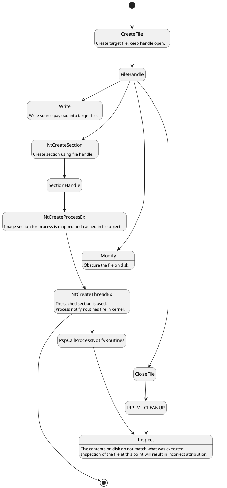

# Process Herpaderping 
![][png.mimioogle]

Process Herpaderping is a method of obscuring the intentions of a process by 
modifying the content on disk after the image has been mapped. This results 
in curious behavior by security products and the OS itself.

![][gif.SurivDemo]

## Summary
Generally, a security product takes action on process creation by registering a 
callback in the Windows Kernel 
([PsSetCreateProcessNotifyRoutineEx][msdn.PsSetCreateProcessNotifyRoutineEx]). 
At this point, a security product may inspect the file that was used to map 
the executable and determine if this process should be allowed to execute. This 
kernel callback is invoked when the initial thread is inserted, not when the 
process object is created. 

Because of this, an actor can create and map a process, modify the content of 
the file, then create the initial thread. A product that does inspection at the 
creation callback would see the modified content. Additionally, some products 
use an on-write scanning approach which consists of monitoring for file writes. 
A familiar optimization here is recording the file has been written to and 
defer the actual inspection until [IRP_MJ_CLEANUP][msdn.IRP_MJ_CLEANUP] 
occurs (e.g. the file handle is closed). Thus, an actor using a 
`write -> map -> modify -> execute -> close` workflow will subvert on-write scanning 
that solely relies on inspection at [IRP_MJ_CLEANUP][msdn.IRP_MJ_CLEANUP].

To abuse this convention, we first write a binary to a target file on disk. 
Then, we map an image of the target file and provide it to the OS to use for 
process creation. The OS kindly maps the original binary for us. Using 
the existing file handle, and before creating the initial thread, we modify the 
target file content to obscure or fake the file backing the image. Some time later, 
we create the initial thread to begin execution of the original binary. Finally, we 
 will close the target file handle. Let's walk through this step-by-step:
1. Write target binary to disk, keeping the handle open. This is what will 
   execute in memory.
2. Map the file as an image section ([NtCreateSection][msdn.NtCreateSection], 
   [SEC_IMAGE][msdn.SEC_IMAGE]).
3. Create the process object using the section handle (`NtCreateProcessEx`).
4. Using the same target file handle, obscure the file on disk.
5. Create the initial thread in the process (`NtCreateThreadEx`).
    - At this point the process creation callback in the kernel will fire. The 
      contents on disk do not match what was mapped. Inspection of the file at 
      this point will result in incorrect attribution.
6. Close the handle. [IRP_MJ_CLEANUP][msdn.IRP_MJ_CLEANUP] will occur here.
    - Since we've hidden the contents of what is executing, inspection at this 
      point will result in incorrect attribution.

![][svg.StateDiagram]
<details>
    <summary>plantuml</summary>


</details>

## Behavior
You'll see in the demo below, `CMD.exe` is used as the execution target. The 
first run overwrites the bytes on disk with a pattern. The second run overwrites 
`CMD.exe` with `ProcessHacker.exe`. The Herpaderping tool fixes up the binary to 
look as close to `ProcessHacker.exe` as possible, even retaining the original 
signature. Note the multiple executions of the same binary and how the process 
looks to the user compared to what is in the file on disk.

![][gif.ProcessHerpaderp]

![][png.procmon]

### Diving Deeper <a name="tag-diving-deeper"></a>
We've observed the behavior and some of this may be surprising. Let's try to 
explain this behavior.

<details> <!--- Collapsible "Diving Deeper" section --->
    <summary>click to expand this section</summary>

#### Repeated executions despite the bits on disk changing
Let's try to understand why the process successfully executes multiple times 
despite the bits on disk not being `CMD.exe`. Below is some `WinDbg` output. 
I've executed the tool as in the demo above, the first herpaderped process was 
created, then I started another. Let's compare:

<details>
    <summary>windbg output</summary>

```
PROCESS ffff998aab671080
    SessionId: 1  Cid: 0230    Peb: 3783820000  ParentCid: 28d4
    DirBase: 12a49a000  ObjectTable: ffff8201fd4cba40  HandleCount:  79.
    Image: lol.exe

0: kd> dt nt!_EPROCESS ffff998aab671080
...
   +0x3c0 SectionObject    : 0xffff8201`ff93db70 Void
...
   +0x448 ImageFilePointer : (null) 
...

0: kd> !object 0xffff8201`ff93db70
Object: ffff8201ff93db70  Type: (ffff998aa54d2e80) Section
    ObjectHeader: ffff8201ff93db40 (new version)
    HandleCount: 0  PointerCount: 1
    Directory Object: 00000000  Name: \Users\jxy\Desktop\lol.exe
```
```
PROCESS ffff998aab971080
    SessionId: 1  Cid: 20a8    Peb: 4d492ca000  ParentCid: 12dc
    DirBase: 199f9e000  ObjectTable: ffff8201ffc3d200  HandleCount:  71.
    Image: lol.exe

0: kd> dt nt!_EPROCESS ffff998aab971080
...
   +0x3c0 SectionObject    : 0xffff8201`fc004a10 Void
...
   +0x448 ImageFilePointer : 0xffff998a`adf2dde0 _FILE_OBJECT
...

0: kd> !object 0xffff8201`ff93db70
Object: ffff8201ff93db70  Type: (ffff998aa54d2e80) Section
    ObjectHeader: ffff8201ff93db40 (new version)
    HandleCount: 0  PointerCount: 1
    Directory Object: 00000000  Name: \Users\jxy\Desktop\lol.exe

0: kd> !object 0xffff998a`adf2dde0
Object: ffff998aadf2dde0  Type: (ffff998aa54d3820) File
    ObjectHeader: ffff998aadf2ddb0 (new version)
    HandleCount: 0  PointerCount: 1
    Directory Object: 00000000  Name: \Users\jxy\Desktop\lol.exe {HarddiskVolume3}
```
</details>

Note the two processes. I've dumped the relevant parts of the `EPROCESS` for 
each. They have different section objects, as expected, as they need their own 
sections since they are independent processes. The first process' 
`ImageFilePointer` is null, since the tool calls `NtCreateProcessEx` and 
explicitly hands the OS a section to use. We'll circle back around to this 
later. For now, let's take a closer look at the [FILE_OBJECT][msdn.FILE_OBJECT]: 

<details>
    <summary>windbg output</summary>

```
0: kd> dt nt!_FILE_OBJECT 0xffff998a`adf2dde0
   +0x000 Type             : 0n5
   +0x002 Size             : 0n216
   +0x008 DeviceObject     : 0xffff998a`a73c8930 _DEVICE_OBJECT
   +0x010 Vpb              : 0xffff998a`a75ec2a0 _VPB
   +0x018 FsContext        : 0xffff8201`fa92a170 Void
   +0x020 FsContext2       : 0xffff8202`0514a2e0 Void
   +0x028 SectionObjectPointer : 0xffff998a`ae08aae8 _SECTION_OBJECT_POINTERS
   +0x030 PrivateCacheMap  : (null) 
   +0x038 FinalStatus      : 0n0
   +0x040 RelatedFileObject : (null) 
   +0x048 LockOperation    : 0 ''
   +0x049 DeletePending    : 0 ''
   +0x04a ReadAccess       : 0x1 ''
   +0x04b WriteAccess      : 0 ''
   +0x04c DeleteAccess     : 0 ''
   +0x04d SharedRead       : 0x1 ''
   +0x04e SharedWrite      : 0 ''
   +0x04f SharedDelete     : 0x1 ''
   +0x050 Flags            : 0x44042
   +0x058 FileName         : _UNICODE_STRING "\Users\jxy\Desktop\lol.exe"
   +0x068 CurrentByteOffset : _LARGE_INTEGER 0x0
   +0x070 Waiters          : 0
   +0x074 Busy             : 0
   +0x078 LastLock         : (null) 
   +0x080 Lock             : _KEVENT
   +0x098 Event            : _KEVENT
   +0x0b0 CompletionContext : (null) 
   +0x0b8 IrpListLock      : 0
   +0x0c0 IrpList          : _LIST_ENTRY [ 0xffff998a`adf2dea0 - 0xffff998a`adf2dea0 ]
   +0x0d0 FileObjectExtension : (null) 
```
</details>

First, that file object looks different than what we had originally opened with. 
This is expected since executing the process normally (as the user would, by 
double clicking it) will cause `explorer.exe` to invoke `NtCreateUserProcess`. 
That somewhat explains the behavior we see. But if it was using the file, 
why did it execute `CMD.exe`? We've overwritten it. Its behavior seems like the 
section is being reused. Let's verify this assumption. The file object stores 
[SECTION_OBJECT_POINTERS][msdn.SECTION_OBJECT_POINTERS] at 
`SectionObjectPointer`. Let's look there. 

```
0: kd> dx -id 0,0,ffff998aa547b2c0 -r1 ((ntkrnlmp!_SECTION_OBJECT_POINTERS *)0xffff998aae08aae8)
((ntkrnlmp!_SECTION_OBJECT_POINTERS *)0xffff998aae08aae8)                 : 0xffff998aae08aae8 [Type: _SECTION_OBJECT_POINTERS *]
    [+0x000] DataSectionObject : 0xffff998aae04c6d0 [Type: void *]
    [+0x008] SharedCacheMap   : 0x0 [Type: void *]
    [+0x010] ImageSectionObject : 0xffff998aa7c2d660 [Type: void *]
```

According to the documentation the 
`DataSectionObject` and `ImageSectionObject` are `CONTROL_AREA` structures. And 
`SharedCacheMap` is `SHARED_CACHE_MAP`. Let's set a breakpoint and see where 
`ImageSectionObject` is accessed. I'll run another instance of `lol.exe`. 

<details>
    <summary>windbg output</summary>

```
ba r8 0xffff998aae08aae8+0x108

Breakpoint 0 hit
nt!MiReferenceControlArea+0x59:
fffff802`2f4955e1 408af8          mov     dil,al
2: kd> k
 # Child-SP          RetAddr           Call Site
00 fffffd89`f2772640 fffff802`2f9f8111 nt!MiReferenceControlArea+0x59
01 fffffd89`f27726d0 fffff802`2f9f8574 nt!MiCreateImageOrDataSection+0x171
02 fffffd89`f27727c0 fffff802`2f9f7bcf nt!MiCreateSection+0xf4
03 fffffd89`f2772940 fffff802`2f9f7960 nt!MiCreateSectionCommon+0x1ff
04 fffffd89`f2772a20 fffff802`2f5d3c15 nt!NtCreateSection+0x60
05 fffffd89`f2772a90 00007ffb`de0fc9b4 nt!KiSystemServiceCopyEnd+0x25
06 00000000`0496d848 00007ffb`db8a1a47 ntdll!NtCreateSection+0x14
07 00000000`0496d850 00007ffb`db8a55a0 KERNELBASE!BasepLoadLibraryAsDataFileInternal+0x2e7
08 00000000`0496da80 00007ffb`db88c41d KERNELBASE!LoadLibraryExW+0xe0
09 00000000`0496daf0 00007ffb`dd39c9c1 KERNELBASE!GetFileVersionInfoSizeExW+0x3d
0a 00000000`0496db50 00007ffb`dd39c94c SHELL32!_LoadVersionInfo+0x39
0b 00000000`0496dbc0 00007ffb`db1c43c1 SHELL32!CVersionPropertyStore::Initialize+0x2c5
...
2d 00000000`0496f3c0 00007ffb`dd376a4a SHELL32!CRegistryVerbsContextMenu::_Execute+0xcb
2e 00000000`0496f430 00007ffb`dd362df3 SHELL32!CRegistryVerbsContextMenu::InvokeCommand+0xaa
2f 00000000`0496f730 00007ffb`dd391069 SHELL32!HDXA_LetHandlerProcessCommandEx+0x117
30 00000000`0496f840 00007ffb`dd54857d SHELL32!CDefFolderMenu::InvokeCommand+0x139
31 00000000`0496fba0 00007ffb`dd7faf49 SHELL32!SHInvokeCommandOnContextMenu2+0x1f5
32 00000000`0496fde0 00007ffb`dc13dd25 SHELL32!s_DoInvokeVerb+0xc9
33 00000000`0496fe50 00007ffb`dc5c7bd4 shcore!_WrapperThreadProc+0xf5
34 00000000`0496ff30 00007ffb`de0cce51 KERNEL32!BaseThreadInitThunk+0x14
35 00000000`0496ff60 00000000`00000000 ntdll!RtlUserThreadStart+0x21

3: kd> g
Breakpoint 0 hit
nt!MiReferenceControlArea+0x59:
fffff802`2f4955e1 408af8          mov     dil,al
3: kd> k
 # Child-SP          RetAddr           Call Site
00 fffffd89`f2771f30 fffff802`2f9f8111 nt!MiReferenceControlArea+0x59
01 fffffd89`f2771fc0 fffff802`2f9f8574 nt!MiCreateImageOrDataSection+0x171
02 fffffd89`f27720b0 fffff802`2fa52b83 nt!MiCreateSection+0xf4
03 fffffd89`f2772230 fffff802`2fa500ee nt!MmCreateSpecialImageSection+0xbb
04 fffffd89`f27722e0 fffff802`2f5d3c15 nt!NtCreateUserProcess+0x54e
05 fffffd89`f2772a90 00007ffb`de0fd8e4 nt!KiSystemServiceCopyEnd+0x25
06 00000000`0496d858 00007ffb`db8df36a ntdll!NtCreateUserProcess+0x14
07 00000000`0496d860 00007ffb`db8dbd06 KERNELBASE!CreateProcessInternalW+0x1f7a
08 00000000`0496e9b0 00007ffb`dc5cbe93 KERNELBASE!CreateProcessW+0x66
09 00000000`0496ea20 00007ffb`db17cf36 KERNEL32!CreateProcessWStub+0x53
...
14 00000000`0496f3c0 00007ffb`dd376a4a SHELL32!CRegistryVerbsContextMenu::_Execute+0xcb
15 00000000`0496f430 00007ffb`dd362df3 SHELL32!CRegistryVerbsContextMenu::InvokeCommand+0xaa
16 00000000`0496f730 00007ffb`dd391069 SHELL32!HDXA_LetHandlerProcessCommandEx+0x117
17 00000000`0496f840 00007ffb`dd54857d SHELL32!CDefFolderMenu::InvokeCommand+0x139
18 00000000`0496fba0 00007ffb`dd7faf49 SHELL32!SHInvokeCommandOnContextMenu2+0x1f5
19 00000000`0496fde0 00007ffb`dc13dd25 SHELL32!s_DoInvokeVerb+0xc9
1a 00000000`0496fe50 00007ffb`dc5c7bd4 shcore!_WrapperThreadProc+0xf5
1b 00000000`0496ff30 00007ffb`de0cce51 KERNEL32!BaseThreadInitThunk+0x14
1c 00000000`0496ff60 00000000`00000000 ntdll!RtlUserThreadStart+0x21

3: kd> g
Breakpoint 0 hit
nt!MiReferenceControlArea+0x59:
fffff802`2f4955e1 408af8          mov     dil,al
0: kd> k
 # Child-SP          RetAddr           Call Site
00 fffffd89`f28b5640 fffff802`2f9f8111 nt!MiReferenceControlArea+0x59
01 fffffd89`f28b56d0 fffff802`2f9f8574 nt!MiCreateImageOrDataSection+0x171
02 fffffd89`f28b57c0 fffff802`2f9f7bcf nt!MiCreateSection+0xf4
03 fffffd89`f28b5940 fffff802`2f9f7960 nt!MiCreateSectionCommon+0x1ff
04 fffffd89`f28b5a20 fffff802`2f5d3c15 nt!NtCreateSection+0x60
05 fffffd89`f28b5a90 00007ffb`de0fc9b4 nt!KiSystemServiceCopyEnd+0x25
06 000000a1`98f7dd78 00007ffb`db8a1a47 ntdll!NtCreateSection+0x14
07 000000a1`98f7dd80 00007ffb`db8a55a0 KERNELBASE!BasepLoadLibraryAsDataFileInternal+0x2e7
08 000000a1`98f7dfb0 00007ffb`dcfab65b KERNELBASE!LoadLibraryExW+0xe0
09 000000a1`98f7e020 00007ffb`dd34bcfc USER32!PrivateExtractIconsW+0x15b
0a 000000a1`98f7e530 00007ffb`dd34ba78 SHELL32!SHPrivateExtractIcons+0x1ec
0b 000000a1`98f7ea30 00007ff7`70a856ee SHELL32!ExtractIconExW+0xe8
```
</details>

As we see, after I double click to start `lol.exe` again, the 
`ImageSectionObject` is accessed from 
[SECTION_OBJECT_POINTERS][msdn.SECTION_OBJECT_POINTERS] of the 
[FILE_OBJECT][msdn.FILE_OBJECT] a number of times. The section data appears to 
be reused. This would ignore the data on disk and helps explain the behavior 
we're seeing with multiple executions. This is a smart optimization, if you've 
already done the work to parse and map the image, why duplicate that work?

With a bit of reverse engineering of `MiReferenceControlArea` we notice:

<details>
    <summary>reversed code</summary>

```cpp
struct CREATE_SECTION_PACKET
{
    ULONG Flags;
    DWORD Unknown04;
    POBJECT_ATTRIBUTES InputObjectAttributes;
    ULONG AllocateAttributes;
    ULONG InputAllocationAttributes;
    UCHAR InputSectionSignatureLevel;
    BYTE Unknown19;
    WORD Unknown1A;
    ULONG InputSectionPageProtection;
    ULONG PageProtectionMask;
    DWORD Unknown24;
    HANDLE InputFileHandle;
    PFILE_OBJECT InputFileObject;
    PFILE_OBJECT FileObject;
    CONTROL_AREA* SectionControlArea;
    KPROCESSOR_MODE InputPreviousMode;
    BYTE Unknown49[67];
    DWORD Unknown8C;
    SECTION* SectionObject;
    PLARGE_INTEGER MaximumSize;
    PACCESS_TOKEN InputToken;
    DWORD InputSessionId;
    DWORD UnknownAC;
    MI_PARTITION* Partition;
    PIRP TopLevelIrp;
    BYTE UnknownC0;
    BYTE UnknownC1[3];
    DWORD UnknownC4;
};

NTSTATUS __fastcall MiReferenceControlArea(
    CREATE_SECTION_PACKET* CreateSectionPacket,
    CONTROL_AREA* ControlArea,
    CONTROL_AREA** ControlAreaOut)
{
    CONTROL_AREA* controlArea;
//...
    fileObject = CreateSectionPacket->FileObject;
    //  
    // Retrieve section object pointers. If SEC_IMAGE use ImageSectionObject 
    // otherwise use DataSectionObject
    //  
    controlArea = fileObject->SectionObjectPointer->DataSectionObject;
    if ((CreateSectionPacket->AllocateAttributes & SEC_IMAGE) != 0)
    {
        controlArea = fileObject->SectionObjectPointer->ImageSectionObject;
    }
//...
//
// Some exceptionally ugly lock loops and validation.
//
//...
            *ControlAreaOut = controlArea;
            return STATUS_SUCCESS;
//...
}

NTSTATUS __fastcall MiCreateImageOrDataSection(
    CREATE_SECTION_PACKET* CreateSectionPacket)
{
    NTSTATUS status;
    PFILE_OBJECT fileObject;
    CONTROL_AREA controlArea;
    CONTROL_AREA* newControlArea;
//...
    fileObject = CreateSectionPacket->InputFileObject;
    if (fileObject)
    {
        //
        // A file object was provided already, use it.
        //
        goto HaveFileObject;
    }
    if ((allocationAttributes & SEC_LARGE_PAGES) == 0)
    {
        //
        // Get the file object form the input file handle.
        //
        status = ObReferenceObjectByHandle(
                     CreateSectionPacket->InputFileHandle,
                     MmMakeFileAccess[CreateSectionPacket->PageProtectionMask & 7],
                     IoFileObjectType,
                     CreateSectionPacket->InputPreviousMode,
                     &fileObject,
                     NULL);
        if (!NT_SUCCESS(status))
        {
            goto Exit;
        }
        if (!fileObject->SectionObjectPointer)
        {
            //
            // If the file handle was used and there was not section crated for 
            // it already, this is a failure condition. 
            //
            status = STATUS_INVALID_FILE_FOR_SECTION;
            goto Exit;
        }

:HaveFileObject
//...
        //
        // Store some information in the packet and the local CONTROL_AREA to 
        // maintain state for further calls.
        //
        ObfReferenceObject(fileObject);
        CreateSectionPacket->FileObject = fileObject;
        controlArea.u.LongFlags = 2;
        controlArea.FilePointer.Value = fileObject;
        newControlArea = NULL;
//...
        while (1)
        {
//...
            //
            // Go reference the correct control area.
            //
            status = MiReferenceControlArea(CreateSectionPacket, 
                                            &controlArea, 
                                            &sectionControlArea);
            if (NT_SUCCESS(status))
            {
                break;
            }
            if ((status == 0xC000060B) || (status == 0xC0000476))
            {
                //
                // The control area is not charged or is invalid.
                //
                goto Exit;
            }
        }
        CreateSectionPacket->SectionControlArea = sectionControlArea;
        if ((sectionControlArea->u.LongFlags & 2) != 0)
        {
            //
            // We have the section control area which will have the reference 
            // section. Now, go create the new one.
            //
            status = MiCreateNewSection(CreateSectionPacket,
                                        &newControlArea);
            if (NT_SUCCESS(status)))
            {
//...
                CreateSectionPacket->SectionControlArea = newControlArea;
                goto Exit;
//...
Exit:
//...
    return status;
}
```
</details>

The above code shows that this path will reference the input file object and 
attempt to reuse the section from the control area to create a new section 
based on it. In our example, this returns to `MiCreateSection` which does some 
finalization. Let's go back to the debugger now and identify that file object. 
From my reverse engineering, I know that `CREATE_SECTION_PACKET` is stored on 
the stack from a higher call. I'll go identify that.

This is the structure `CREATE_SECTION_PACKET` in the stack starting at 
`InputFileHandle` and ending at `FileObject`. Between these fields there exists 
`InputFileObject`:
```
0: kd> dq fffffd89`f016b868 L3
fffffd89`f016b868  00000000`0000255c 00000000`00000000
fffffd89`f016b878  ffff998a`ae91ea20
```

The input file object is null, which is expected in this path. And the 
`InputFileHandle` is a handle to an almost identical  
[FILE_OBJECT][msdn.FILE_OBJECT] from the `EPROCESS` of the previous process. 
But it isn't the same. However, the `SectionObjectPointer` is the same for both 
objects.

<details>
    <summary>windbg output</summary>

```
0: kd> !handle 00000000`0000255c

PROCESS ffff998aab1b2480
    SessionId: 1  Cid: 12dc    Peb: 0099d000  ParentCid: 12b8
    DirBase: 1ab742000  ObjectTable: ffff8201fa4fa6c0  HandleCount: 2041.
    Image: explorer.exe

Handle table at ffff8201fa4fa6c0 with 2041 entries in use

255c: Object: ffff998aae91ea20  GrantedAccess: 00120089 (Protected) (Inherit) (Audit) Entry: ffff8201fbdf9570
Object: ffff998aae91ea20  Type: (ffff998aa54d3820) File
    ObjectHeader: ffff998aae91e9f0 (new version)
        HandleCount: 1  PointerCount: 32770
        Directory Object: 00000000  Name: \Users\jxy\Desktop\lol.exe {HarddiskVolume3}

0: kd> !object ffff998a`ae91ea20
Object: ffff998aae91ea20  Type: (ffff998aa54d3820) File
    ObjectHeader: ffff998aae91e9f0 (new version)
    HandleCount: 1  PointerCount: 32770
    Directory Object: 00000000  Name: \Users\jxy\Desktop\lol.exe {HarddiskVolume3}
0: kd> dt nt!_FILE_OBJECT ffff998a`ae91ea20
   +0x000 Type             : 0n5
   +0x002 Size             : 0n216
   +0x008 DeviceObject     : 0xffff998a`a73c8930 _DEVICE_OBJECT
   +0x010 Vpb              : 0xffff998a`a75ec2a0 _VPB
   +0x018 FsContext        : 0xffff8201`fa92a170 Void
   +0x020 FsContext2       : 0xffff8201`ff956940 Void
   +0x028 SectionObjectPointer : 0xffff998a`ae08aae8 _SECTION_OBJECT_POINTERS
   +0x030 PrivateCacheMap  : (null) 
   +0x038 FinalStatus      : 0n0
   +0x040 RelatedFileObject : (null) 
   +0x048 LockOperation    : 0 ''
   +0x049 DeletePending    : 0 ''
   +0x04a ReadAccess       : 0x1 ''
   +0x04b WriteAccess      : 0 ''
   +0x04c DeleteAccess     : 0 ''
   +0x04d SharedRead       : 0x1 ''
   +0x04e SharedWrite      : 0 ''
   +0x04f SharedDelete     : 0x1 ''
   +0x050 Flags            : 0xc0042
   +0x058 FileName         : _UNICODE_STRING "\Users\jxy\Desktop\lol.exe"
   +0x068 CurrentByteOffset : _LARGE_INTEGER 0x0
   +0x070 Waiters          : 0
   +0x074 Busy             : 0
   +0x078 LastLock         : (null) 
   +0x080 Lock             : _KEVENT
   +0x098 Event            : _KEVENT
   +0x0b0 CompletionContext : (null) 
   +0x0b8 IrpListLock      : 0
   +0x0c0 IrpList          : _LIST_ENTRY [ 0xffff998a`ae91eae0 - 0xffff998a`ae91eae0 ]
   +0x0d0 FileObjectExtension : (null) 
```
</details>

We now see how the [SECTION_OBJECT_POINTERS][msdn.SECTION_OBJECT_POINTERS] are 
shared between each [FILE_OBJECT][msdn.FILE_OBJECT]. The new bits from the file 
don't ever become mapped for a new process until all the 
[FILE_OBJECT][msdn.FILE_OBJECT] are reclaimed with the shared 
`SectionObjectPointer` and `ImageSectionObject`.

<details>
    <summary>windbg output</summary>

```
Breakpoint 0 hit
nt!MiClearFilePointer+0x5d:
fffff802`2f4f9385 ebe2            jmp     nt!MiClearFilePointer+0x41 (fffff802`2f4f9369)
3: kd> k
 # Child-SP          RetAddr           Call Site
00 fffffd89`f254f690 fffff802`2f56f501 nt!MiClearFilePointer+0x5d
01 fffffd89`f254f6c0 fffff802`2f56f4a9 nt!MiDestroySection+0x29
02 fffffd89`f254f6f0 fffff802`2f5eaca0 nt!MiCleanSection+0x6d
03 fffffd89`f254f790 fffff802`2f42324e nt!MiCheckControlArea+0x1c7a40
04 fffffd89`f254f800 fffff802`2f9da4c3 nt!MiDereferenceControlAreaBySection+0x2a
05 fffffd89`f254f830 fffff802`2fa189e0 nt!MiSectionDelete+0x83
06 fffffd89`f254f860 fffff802`2f4a1004 nt!ObpRemoveObjectRoutine+0x80
07 fffffd89`f254f8c0 fffff802`2fa6d64c nt!ObfDereferenceObject+0xa4
08 fffffd89`f254f900 fffff802`2fa26743 nt!PspRundownSingleProcess+0x16c
09 fffffd89`f254f980 fffff802`2fa5c4fb nt!PspExitThread+0x60b
0a fffffd89`f254fa90 fffff802`2f5d3c15 nt!NtTerminateProcess+0xeb
0b fffffd89`f254fb00 00007ffb`de0fc5f4 nt!KiSystemServiceCopyEnd+0x25
0c 00000025`020ff718 00000000`00000000 ntdll!NtTerminateProcess+0x14
```
</details>

#### When is the image section cached? 
Given the information in the previous section, we know the image section object
is cached in the [FILE_OBJECT][msdn.FILE_OBJECT], this image section is then 
used as a "reference" image section when a new process is created, finally we 
know that this cached "reference" image section is shared between each 
[FILE_OBJECT][msdn.FILE_OBJECT]. 

But when is that initial section created and cached? This is strait forward to 
identify with some breakpoints:

<details>
    <summary>windbg output</summary>

```
2: kd> bp nt!NtCreateSection
2: kd> g
Breakpoint 1 hit
nt!NtCreateSection:
fffff804`3ebd9fe0 4053            push    rbx
3: kd> bp /w @$curprocess.Name.Contains("Herpaderp")
breakpoint 1 redefined
3: kd> g;k
0: kd> k
 # Child-SP          RetAddr               Call Site
00 fffff58c`00d83a08 fffff804`3e7d2e15     nt!NtCreateSection
01 fffff58c`00d83a10 00007fff`c0ebca04     nt!KiSystemServiceCopyEnd+0x25
02 00000012`076fe9e8 00007fff`c0e6b365     ntdll!NtCreateSection+0x14
03 00000012`076fe9f0 00007fff`c0e6b662     ntdll!CsrpConnectToServer+0x1b1
04 00000012`076febe0 00007fff`be7fadf2     ntdll!CsrClientConnectToServer+0xe2
05 00000012`076fec40 00007fff`be7faa5d     KERNELBASE!_KernelBaseBaseDllInitialize+0x212
06 00000012`076feec0 00007fff`c0e450a1     KERNELBASE!KernelBaseDllInitialize+0xd
07 00000012`076feef0 00007fff`c0e89405     ntdll!LdrpCallInitRoutine+0x65
08 00000012`076fef60 00007fff`c0e891f8     ntdll!LdrpInitializeNode+0x1b1
09 00000012`076ff0a0 00007fff`c0e89222     ntdll!LdrpInitializeGraphRecurse+0x80
0a 00000012`076ff0e0 00007fff`c0e4aa97     ntdll!LdrpInitializeGraphRecurse+0xaa
0b 00000012`076ff120 00007fff`c0e42591     ntdll!LdrpPrepareModuleForExecution+0xbf
0c 00000012`076ff160 00007fff`c0e422a8     ntdll!LdrpLoadDllInternal+0x199
0d 00000012`076ff1e0 00007fff`c0e41764     ntdll!LdrpLoadDll+0xa8
0e 00000012`076ff390 00007fff`c0ef4193     ntdll!LdrLoadDll+0xe4
0f 00000012`076ff480 00007fff`c0ee1df5     ntdll!LdrpInitializeProcess+0x1a0b
10 00000012`076ff8c0 00007fff`c0e91853     ntdll!_LdrpInitialize+0x50589
11 00000012`076ff960 00007fff`c0e917fe     ntdll!LdrpInitialize+0x3b
12 00000012`076ff990 00000000`00000000     ntdll!LdrInitializeThunk+0xe
0: kd> g;k
Breakpoint 1 hit
 # Child-SP          RetAddr               Call Site
00 fffff58c`00d83a08 fffff804`3e7d2e15     nt!NtCreateSection
01 fffff58c`00d83a10 00007fff`c0ebca04     nt!KiSystemServiceCopyEnd+0x25
02 00000012`076fdee8 00007ff7`511b6bcb     ntdll!NtCreateSection+0x14
03 00000012`076fdef0 00000012`076fe048     ProcessHerpaderping!Herpaderp::ExecuteProcess+0x4bb
1: kd> !handle 0xac

PROCESS ffffa78260243440
    SessionId: 2  Cid: 043c    Peb: 12075a2000  ParentCid: 2200
    DirBase: 36641002  ObjectTable: ffffd08243acfe00  HandleCount:  41.
    Image: ProcessHerpaderping.exe

Handle table at ffffd08243acfe00 with 41 entries in use

00ac: Object: ffffa782611330b0  GrantedAccess: 0012019f Entry: ffffd08246cef2b0
Object: ffffa782611330b0  Type: (ffffa782594fb2a0) File
    ObjectHeader: ffffa78261133080 (new version)
        HandleCount: 1  PointerCount: 32754
        Directory Object: 00000000  Name: \Users\Jxy\Desktop\lol.exe {HarddiskVolume4}

1: kd> dx ((nt!_FILE_OBJECT*)0xffffa782611330b0)->SectionObjectPointer
((nt!_FILE_OBJECT*)0xffffa782611330b0)->SectionObjectPointer                 : 0xffffa78260d1e708 [Type: _SECTION_OBJECT_POINTERS *]
    [+0x000] DataSectionObject : 0xffffa7825ce5fb30 [Type: void *]
    [+0x008] SharedCacheMap   : 0xffffa78260e24da0 [Type: void *]
    [+0x010] ImageSectionObject : 0x0 [Type: void *]
1: kd> ba w8 0xffffa78260d1e708+0x10
1: kd> g
Breakpoint 2 hit
nt!MiReferenceControlArea+0x129:
fffff804`3e62d7f1 33d2            xor     edx,edx
1: kd> k
 # Child-SP          RetAddr               Call Site
00 fffff58c`00d835c0 fffff804`3ebda7f1     nt!MiReferenceControlArea+0x129
01 fffff58c`00d83650 fffff804`3ebdac54     nt!MiCreateImageOrDataSection+0x171
02 fffff58c`00d83740 fffff804`3ebda2af     nt!MiCreateSection+0xf4
03 fffff58c`00d838c0 fffff804`3ebda040     nt!MiCreateSectionCommon+0x1ff
04 fffff58c`00d839a0 fffff804`3e7d2e15     nt!NtCreateSection+0x60
05 fffff58c`00d83a10 00007fff`c0ebca04     nt!KiSystemServiceCopyEnd+0x25
06 00000012`076fdee8 00007ff7`511b6bcb     ntdll!NtCreateSection+0x14
07 00000012`076fdef0 00000012`076fe048     ProcessHerpaderping!Herpaderp::ExecuteProcess+0x4bb
1: kd> dx ((nt!_FILE_OBJECT*)0xffffa782611330b0)->SectionObjectPointer
((nt!_FILE_OBJECT*)0xffffa782611330b0)->SectionObjectPointer                 : 0xffffa78260d1e708 [Type: _SECTION_OBJECT_POINTERS *]
    [+0x000] DataSectionObject : 0xffffa7825ce5fb30 [Type: void *]
    [+0x008] SharedCacheMap   : 0xffffa78260e24da0 [Type: void *]
    [+0x010] ImageSectionObject : 0xfffff58c00d83680 [Type: void *]
```
</details>

The above `WinDbg` output shows the image section object is cached within the 
first [FILE_OBJECT][msdn.FILE_OBJECT] at the call to 
[NtCreateSection][msdn.NtCreateSection]. We abuse this by forcing the OS to 
cache an image section object that will be used when process is executed. 
Before we begin execution of the process, we obscure the content on disk, 
the changes are not reflected in the cached image section.

There is an opportunity to inspect section creation from the kernel. 
[IRP_MJ_ACQUIRE_FOR_SECTION_SYNCHRONIZATION][msdn.IRP_MJ_ACQUIRE_FOR_SECTION_SYNCHRONIZATION]
is invoked when the file and section control area locks are acquired. However, 
there is not a clear indicator in the callback data, in this case, the 
callback data does not contain the `AllocationAttributes` (`SEC_IMAGE`). For 
the exploit, in this path, the `PageProtection` will only show `PAGE_READONLY`. 
There are no `AllocationAttributes`, a future release on Windows 10 will extend 
this data to include the `AllocationAttributes`. So, `SEC_IMAGE` will be 
available, however inspection here is not ideal as software will map in this 
manner without the intention of executing a new process. Placing a hook sooner 
in this call stack might help, but we run into the same complications with 
respect to processes creating a section in this manner without the intention 
of using it to execute a process.

I'll note here that the section this section is then mapped into the process at 
the `NtCreateProcess` call:

<details>
    <summary>windbg output</summary>

```
3: kd> k
 # Child-SP          RetAddr               Call Site
00 fffff58c`00d836d8 fffff804`3ed81a63     nt!PspAllocateProcess
01 fffff58c`00d836e0 fffff804`3eec5df5     nt!PspCreateProcess+0x233
02 fffff58c`00d839b0 fffff804`3e7d2e15     nt!NtCreateProcessEx+0x85
03 fffff58c`00d83a10 00007fff`c0ebca64     nt!KiSystemServiceCopyEnd+0x25
04 00000012`076fdee8 00007ff7`511b6d71     ntdll!NtCreateProcessEx+0x14
05 00000012`076fdef0 00000012`076fdf58     ProcessHerpaderping!Herpaderp::ExecuteProcess+0x661
3: kd> gu
nt!PspCreateProcess+0x233:
fffff804`3ed81a63 8bf0            mov     esi,eax
0: kd> gu
nt!NtCreateProcessEx+0x85:
fffff804`3eec5df5 4883c458        add     rsp,58h
0: kd> !process 0 0 lol.exe
PROCESS ffffa78260fb8080
    SessionId: 2  Cid: 02b4    Peb: e52ac5f000  ParentCid: 043c
    DirBase: 42546002  ObjectTable: ffffd0824a0f4a40  HandleCount:   3.
    Image: lol.exe

0: kd> .process /r /p ffffa78260fb8080
Implicit process is now ffffa782`60fb8080
.cache forcedecodeuser done
Loading User Symbols
PEB is paged out (Peb.Ldr = 000000e5`2ac5f018).  Type ".hh dbgerr001" for details
0: kd> !vad
VAD             Level         Start             End              Commit
ffffa782606ef080  3           7ffe0           7ffe0               1 Private      READONLY           
ffffa782606ef120  2           7ffeb           7ffeb               1 Private      READONLY           
ffffa782606f06b0  1         e52ac00         e52adff               1 Private      READWRITE          
ffffa7825d3fea50  3        20ba8dc0        20ba8dda               0 Mapped       READONLY           Pagefile section, shared commit 0x1b
ffffa7825d3ff630  2       7df5e58e0       7df5e58e0               0 Mapped       READONLY           Pagefile section, shared commit 0x1
ffffa7825d3ff590  3       7df5e58f0       7df5e5912               0 Mapped       READONLY           Pagefile section, shared commit 0x23
ffffa7825d3ff3b0  0       7df5e5920       7ff5e591f               2 Mapped       NO_ACCESS          Pagefile section, shared commit 0xdd6
ffffa7825d3fd8d0  1       7ff7f4200       7ff7f4264              29 Mapped  Exe  EXECUTE_WRITECOPY  \Users\Jxy\Desktop\lol.exe
ffffa7825d3fe4b0  2       7fffc0e20       7fffc100f              16 Mapped  Exe  EXECUTE_WRITECOPY  \Windows\System32\ntdll.dll

Total VADs: 9, average level: 2, maximum depth: 3
Total private commit: 0x32 pages (200 KB)
Total shared commit:  0xe7a pages (14824 KB)
```
</details>

#### What this means for the process creation callback 
[PS_CREATE_NOTIFY_INFO][msdn.PS_CREATE_NOTIFY_INFO] contains a `FileObject`, 
which according to the documentation, is the file object of the process being 
created. How does [PS_CREATE_NOTIFY_INFO][msdn.PS_CREATE_NOTIFY_INFO] in the 
process creation callback get populated? Well `PspCallProcessNotifyRoutines` 
calls `PsReferenceProcessFilePointer` of course:

<details>
    <summary>reversed code</summary>

```cpp
NTSTATUS __fastcall PsReferenceProcessFilePointer(
    PEPROCESS Process, 
    PFILE_OBJECT* FileObject)
{
    NTSTATUS status;
    CONTROL_AREA* controlArea;

    status = STATUS_UNSUCCESSFUL;

    if (ExAcquireRundownProtection(&Process->RundownProtect))
    {
       if (Process->SectionObject)
       {
           controlArea = MiSectionControlArea(Process->SectionObject);
           *FileObject = MiReferenceControlAreaFile(controlArea);
           status = STATUS_SUCCESS;
       }

       ExReleaseRundownProtection(&Process->RundownProtect);
    }

    return status;
}
```
</details>

We see here it gets the `FileObject` from the `SectionObject` field in the 
`EPROCESS`. What does this mean for the callback? I wrote a simple test driver 
that registers for the callback and prints some debug info.

<details>
    <summary>windbg output</summary>

```
Process:    FFFF998AAC8DF080
ProcessId:  00000000000008C0
CreateInfo: FFFFFD89F16F8E20
  Flags:           0x00000000
  ParentProcessId: 0000000000001B90
  FileObject:      FFFF998AB534DAA0
  ImageFileName:   "\Users\jxy\Desktop\lol.exe"
  CommandLine:     ""
```
```
0: kd> dt nt!_FILE_OBJECT FFFF998AB534DAA0
   +0x000 Type             : 0n5
   +0x002 Size             : 0n216
   +0x008 DeviceObject     : 0xffff998a`a73c8930 _DEVICE_OBJECT
   +0x010 Vpb              : 0xffff998a`a75ec2a0 _VPB
   +0x018 FsContext        : 0xffff8202`23a8a170 Void
   +0x020 FsContext2       : 0xffff8202`23a8a3d0 Void
   +0x028 SectionObjectPointer : 0xffff998a`b5aa1118 _SECTION_OBJECT_POINTERS
   +0x030 PrivateCacheMap  : (null) 
   +0x038 FinalStatus      : 0n0
   +0x040 RelatedFileObject : 0xffff998a`b239c560 _FILE_OBJECT
   +0x048 LockOperation    : 0 ''
   +0x049 DeletePending    : 0 ''
   +0x04a ReadAccess       : 0x1 ''
   +0x04b WriteAccess      : 0x1 ''
   +0x04c DeleteAccess     : 0 ''
   +0x04d SharedRead       : 0x1 ''
   +0x04e SharedWrite      : 0x1 ''
   +0x04f SharedDelete     : 0x1 ''
   +0x050 Flags            : 0x44042
   +0x058 FileName         : _UNICODE_STRING "\Users\jxy\Desktop\lol.exe"
   +0x068 CurrentByteOffset : _LARGE_INTEGER 0x44600
   +0x070 Waiters          : 0
   +0x074 Busy             : 0
   +0x078 LastLock         : (null) 
   +0x080 Lock             : _KEVENT
   +0x098 Event            : _KEVENT
   +0x0b0 CompletionContext : (null) 
   +0x0b8 IrpListLock      : 0
   +0x0c0 IrpList          : _LIST_ENTRY [ 0xffff998a`b534db60 - 0xffff998a`b534db60 ]
   +0x0d0 FileObjectExtension : (null) 
```
</details>

That's the same access that I opened the file with to create the section. Let's 
try something. Let's run `ProcessHerpaderping` with the `--exclusive` option. 
This will hold the initial file handle open with exclusive rights.

<details>
    <summary>windbg output</summary>

```
Process:    FFFF998AB2BD5080
ProcessId:  0000000000001C10
CreateInfo: FFFFFD89F1B1DE20
  Flags:           0x00000000
  ParentProcessId: 000000000000255C
  FileObject:      FFFF998AB21A6330
  ImageFileName:   "\Users\jxy\Desktop\lol.exe"
  CommandLine:     ""

0: kd> dt nt!_FILE_OBJECT FFFF998AB21A6330
   +0x000 Type             : 0n5
   +0x002 Size             : 0n216
   +0x008 DeviceObject     : 0xffff998a`a73c8930 _DEVICE_OBJECT
   +0x010 Vpb              : 0xffff998a`a75ec2a0 _VPB
   +0x018 FsContext        : 0xffff8202`23a8a170 Void
   +0x020 FsContext2       : 0xffff8202`21292760 Void
   +0x028 SectionObjectPointer : 0xffff998a`b5aa1118 _SECTION_OBJECT_POINTERS
   +0x030 PrivateCacheMap  : 0xffff998a`ab2d3a68 Void
   +0x038 FinalStatus      : 0n0
   +0x040 RelatedFileObject : 0xffff998a`b239dcd0 _FILE_OBJECT
   +0x048 LockOperation    : 0 ''
   +0x049 DeletePending    : 0 ''
   +0x04a ReadAccess       : 0x1 ''
   +0x04b WriteAccess      : 0x1 ''
   +0x04c DeleteAccess     : 0 ''
   +0x04d SharedRead       : 0 ''
   +0x04e SharedWrite      : 0 ''
   +0x04f SharedDelete     : 0 ''
   +0x050 Flags            : 0x40042
   +0x058 FileName         : _UNICODE_STRING "\Users\jxy\Desktop\lol.exe"
   +0x068 CurrentByteOffset : _LARGE_INTEGER 0x44600
   +0x070 Waiters          : 0
   +0x074 Busy             : 0
   +0x078 LastLock         : (null) 
   +0x080 Lock             : _KEVENT
   +0x098 Event            : _KEVENT
   +0x0b0 CompletionContext : (null) 
   +0x0b8 IrpListLock      : 0
   +0x0c0 IrpList          : _LIST_ENTRY [ 0xffff998a`b21a63f0 - 0xffff998a`b21a63f0 ]
   +0x0d0 FileObjectExtension : (null) 
```
</details>

I control this file access now. Meaning, I may hold this handle open and 
prevent others from accessing the file. While this isn't horrible for the 
kernel callback, it means any downstream logic that that makes the assumption 
they can open the file with read access will be broken. Well, such logic would have 
already been broken, given that I've overwritten the file content. And the kernel callback 
is boned too, since reading directly from the file using that 
[FILE_OBJECT][msdn.FILE_OBJECT] will just read the wrong data.

##### But wait, there's more...
This also means if I try to execute that process again, it does not work! I get 
a sharing violation. From user mode, without access to that original target 
file handle, no one may conventionally execute the process.

</details> <!--- End of collapsible "Diving Deeper" section.  --->

## Background and Motivation
When designing products for securing Windows platforms, many engineers in 
this field (myself included) have fallen on preconceived notions with respect 
to how the OS will handle data. In this scenario, some might expect the file on 
disk to remain "locked" when the process is created. You can't delete the file. 
You can't write to it. But you can rename it. Seen here, under the right 
conditions, you can in fact write to it. Remain vigilant on your assumptions, 
always question them, and do your research.

The motivation for this research came about when discovering how to do analysis 
when a file is written. With prior background researching process Hollowing and 
Doppelganging, I had theorized this might be possible. The goal is to provide 
better security. You cannot create a better lock without first understanding 
how to break the old one.

### Similar Techniques
Herpaderping is similar to Hollowing and Doppelganging however there are some 
key differences:

#### Process Hollowing
Process Hollowing involves modifying the mapped section before execution 
begins, which abstractly this looks like: `map -> modify section -> execute`. This workflow 
results in the intended execution flow of the Hollowed process diverging into 
unintended code. Doppelganging might be considered a form of Hollowing. 
However, Hollowing, in my opinion, is closer to injection in that Hollowing 
usually involves an explicit write to the already mapped code. This differs 
from Herpaderping where there are no modified sections.

#### Process Doppelganging
Process Doppelganging is closer to Herpaderping. Doppelganging abuses 
transacted file operations and generally involves these steps: 
`transact -> write -> map -> rollback -> execute`. 
In this workflow, the OS will create the image section and account for 
transactions, so the cached image section ends up being what you wrote to the 
transaction. The OS has patched this technique. Well, they patched the crash it caused. 
Maybe they consider this a "legal" use of a transaction. Thankfully, Windows 
Defender does catch the Doppelganging technique. Doppelganging differs from 
Herpaderping in that Herpaderping does not rely on transacted file operations. 
And Defender doesn't catch Herpaderping.

#### Comparison
For reference, the generalized techniques: 
| Type          | Technique                                         |
| :------------ | :------------------------------------------------ |
| Hollowing     | `map -> modify section -> execute`                |
| Doppelganging | `transact -> write -> map -> rollback -> execute` |
| Herpaderping  | `write -> map -> modify -> execute -> close`      |

We can see the differences laid out here. While Herpaderping is arguably 
noisier than Doppelganging, in that the malicious bits do hit the disk, we've 
seen that security products are still incapable of detecting Herpaderping. 

## Possible Solution
There is not a clear fix here. It seems reasonable that preventing an image 
section from being mapped/cached when there is write access to the file 
should close the hole. However, that may or may not be a practical solution.

Another option might be to flush the changes to the file through to the cached 
image section if it hasn't yet been mapped into a process. However, since the 
map into the new process occurs at `NtCreateProcess` that is probably not a 
viable solution.

From a detection standpoint, there is not a great way to identify the actual 
bits that got mapped, inspection at [IRP_MJ_CLEANUP][msdn.IRP_MJ_CLEANUP] or 
a callback registered at 
[PsSetCreateProcessNotifyRoutineEx][msdn.PsSetCreateProcessNotifyRoutineEx] 
results in incorrect attribution since the bits on disk have been changed, you 
would have to rebuild the file from the section that got created. It's worth 
pointing out here there is a new callback in Windows 10 you may register for 
[PsSetCreateProcessNotifyRoutineEx2][msdn.PsSetCreateProcessNotifyRoutineEx2] 
however this suffers from the same problem as the previous callback, it's 
called out when the initial thread is executed, not when the process object is 
created. Microsoft did add 
[PsSetCreateThreadNotifyRoutineEx][msdn.PsSetCreateThreadNotifyRoutineEx] which 
is called out when the initial thread is inserted if registered with 
[PsCreateThreadNotifyNonSystem][msdn.PSCREATETHREADNOTIFYTYPE], opposed to when 
it is about to begin execution (as the old callback did). Extending 
[PSCREATEPROCESSNOTIFYTYPE][msdn.PSCREATEPROCESSNOTIFYTYPE] to be called out 
when the process object is created won't help either, we've seen in the 
[Diving Deeper](#tag-diving-deeper) section that the image section object is 
cached on the [NtCreateSection][msdn.NtCreateSection] call not 
`NtCreateProcess`.

We can't easily identify what got executed. We're left with trying to detect 
the exploitive behavior by the actor, I'll leave discovery of the behavior 
indicators as an exercise for the reader.

## Known Affected Platforms
Below is a list of products and Windows OSes that have been tested as of 
(8/31/2020). Tests were carried out with a known malicious binary.

| Operating System                    | Version         | Vulnerable |
| :---------------------------------- | :-------------- | :--------: |
| Windows 7 Enterprise x86            | 6.1.7601        | Yes        |
| Windows 10 Pro x64                  | 10.0.18363.900  | Yes        |
| Windows 10 Pro Insider Preview x64  | 10.0.20170.1000 | Yes        |
| Windows 10 Pro Insider Preview x64  | 10.0.20201.1000 | Yes        |

| Security Product                    | Version       | Vulnerable |
| :---------------------------------- | :------------ | :--------: |
| Windows Defender AntiMalware Client | 4.18.2006.10  | Yes        |
| Windows Defender Engine             | 1.1.17200.2   | Yes        |
| Windows Defender Antivirus          | 1.319.1127.0  | Yes        |
| Windows Defender Antispyware        | 1.319.1127.0  | Yes        |
| Windows Defender AntiMalware Client | 4.18.2007.6   | Yes        |
| Windows Defender Engine             | 1.1.17300.2   | Yes        |
| Windows Defender Antivirus          | 1.319.1676.0  | Yes        |
| Windows Defender Antispyware        | 1.319.1676.0  | Yes        |
| Windows Defender AntiMalware Client | 4.18.2007.8   | Yes        |
| Windows Defender Engine             | 1.1.17400.5   | Yes        |
| Windows Defender Antivirus          | 1.323.267.0   | Yes        |
| Windows Defender Antispyware        | 1.323.267.0   | Yes        |

## Responsible Disclosure
This vulnerability was disclosed to the Microsoft Security Response Center 
(MSRC) on 7/17/2020 and a case was opened by MSRC on 7/22/2020. MSRC concluded 
their investigation on 8/25/2020 and determined the findings are valid but do 
not meet their bar for immediate servicing. At this time their case is closed, 
without resolution, and is marked for future review, with no timeline.

We disagree on the severity of this bug; this was communicated to MSRC on 
8/27/2020. 
1. There are similar vulnerabilities in this class (Hollowing and 
Doppelganging). 
1. The vulnerability is shown to defeat security features inherent to the 
OS (Windows Defender).
1. The vulnerability allows an actor to gain execution of arbitrary code.
1. The user is not notified of the execution of unintended code.
1. The process information presented to the user does not accurately reflect 
what is executing. 
1. Facilities to accurately identify the process are not intuitive or 
incorrect, even from the kernel. 


# Source 
This repo contains a tool for exercising the Herpaderping method of process 
obfuscation. Usage is as follows:
```
Process Herpaderping Tool - Copyright (c) Johnny Shaw
ProcessHerpaderping.exe SourceFile TargetFile [ReplacedWith] [Options...]
Usage:
  SourceFile               Source file to execute.
  TargetFile               Target file to execute the source from.
  ReplacedWith             File to replace the target with. Optional,
                           default overwrites the binary with a pattern.
  -h,--help                Prints tool usage.
  -d,--do-not-wait         Does not wait for spawned process to exit,
                           default waits.
  -l,--logging-mask number Specifies the logging mask, defaults to full
                           logging.
                               0x1   Successes
                               0x2   Informational
                               0x4   Warnings
                               0x8   Errors
                               0x10  Contextual
  -q,--quiet               Runs quietly, overrides logging mask, no title.
  -r,--random-obfuscation  Uses random bytes rather than a pattern for
                           file obfuscation.
  -e,--exclusive           Target file is created with exclusive access and
                           the handle is held open as long as possible.
                           Without this option the handle has full share
                           access and is closed as soon as possible.
  -u,--do-not-flush-file   Does not flush file after overwrite.
  -c,--close-file-early    Closes file before thread creation (before the
                           process notify callback fires in the kernel).
                           Not valid with "--exclusive" option.
  -k,--kill                Terminates the spawned process regardless of
                           success or failure, this is useful in some
                           automation environments. Forces "--do-not-wait
                           option.
```

## Cloning and Building
The repo uses submodules, after cloning be sure to init and update the 
submodules. Projects files are targeted to Visual Studio 2019.
```
git clone https://github.com/jxy-s/herpaderping.git
cd .\herpaderping\
git submodule update --init --recursive
MSBuild .\herpaderping.sln
```

## Credits
The following are used without modification. Credits to their authors.
- [Windows Implementation Libraries (WIL)][github.wil]  
A header-only C++ library created to make life easier for developers on Windows 
through readable type-safe C++ interfaces for common Windows coding patterns.  
- [Process Hacker Native API Headers][github.phnt]   
Collection of Native API header files. Gathered from Microsoft header files and 
symbol files, as well as a lot of reverse engineering and guessing.

[//]: # (Hyperlink IDs)
[github.wil]: https://github.com/microsoft/wil
[github.phnt]: https://github.com/processhacker/phnt
[msdn.PsSetCreateProcessNotifyRoutineEx]: https://docs.microsoft.com/en-us/windows-hardware/drivers/ddi/ntddk/nf-ntddk-pssetcreateprocessnotifyroutineex
[msdn.PsSetCreateProcessNotifyRoutineEx2]: https://docs.microsoft.com/en-us/windows-hardware/drivers/ddi/ntddk/nf-ntddk-pssetcreateprocessnotifyroutineex2
[msdn.PsSetCreateThreadNotifyRoutineEx]: https://docs.microsoft.com/en-us/windows-hardware/drivers/ddi/ntddk/nf-ntddk-pssetcreatethreadnotifyroutineex
[msdn.PSCREATETHREADNOTIFYTYPE]: https://docs.microsoft.com/en-us/windows-hardware/drivers/ddi/ntddk/ne-ntddk-_pscreatethreadnotifytype
[msdn.PSCREATEPROCESSNOTIFYTYPE]: https://docs.microsoft.com/en-us/windows-hardware/drivers/ddi/ntddk/ne-ntddk-_pscreateprocessnotifytype
[msdn.IRP_MJ_CLEANUP]: https://docs.microsoft.com/en-us/windows-hardware/drivers/kernel/irp-mj-cleanup
[msdn.NtCreateSection]: https://docs.microsoft.com/en-us/windows-hardware/drivers/ddi/wdm/nf-wdm-zwcreatesection
[msdn.SEC_IMAGE]: https://docs.microsoft.com/en-us/windows/win32/api/winbase/nf-winbase-createfilemappinga
[msdn.IRP_MJ_ACQUIRE_FOR_SECTION_SYNCHRONIZATION]: https://docs.microsoft.com/en-us/windows-hardware/drivers/ifs/flt-parameters-for-irp-mj-acquire-for-section-synchronization
[msdn.IRP_MJ_WRITE]: https://docs.microsoft.com/en-us/windows-hardware/drivers/kernel/irp-mj-write 
[msdn.FILE_OBJECT]: https://docs.microsoft.com/en-us/windows-hardware/drivers/ddi/wdm/ns-wdm-_file_object
[msdn.SECTION_OBJECT_POINTERS]: https://docs.microsoft.com/en-us/windows-hardware/drivers/ddi/wdm/ns-wdm-_section_object_pointers
[msdn.PS_CREATE_NOTIFY_INFO]: https://docs.microsoft.com/en-us/windows-hardware/drivers/ddi/ntddk/ns-ntddk-_ps_create_notify_info

[//]: # (Relative Path IDs)
[gif.ProcessHerpaderp]: res/ProcessHerpaderp.gif
[gif.SurivDemo]: res/SurivDemo.gif
[png.procmon]: res/procmon.png
[png.mimioogle]: res/mimioogle.png
[svg.StateDiagram]: res/StateDiagram.svg
